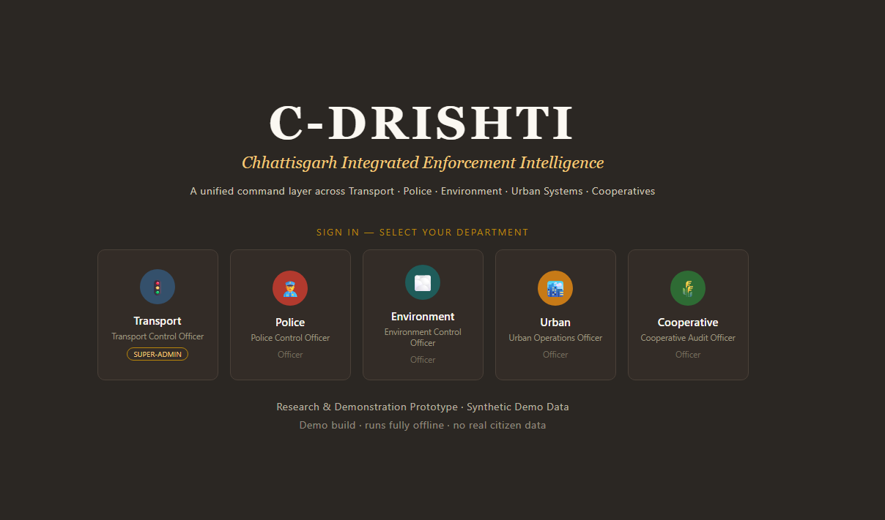
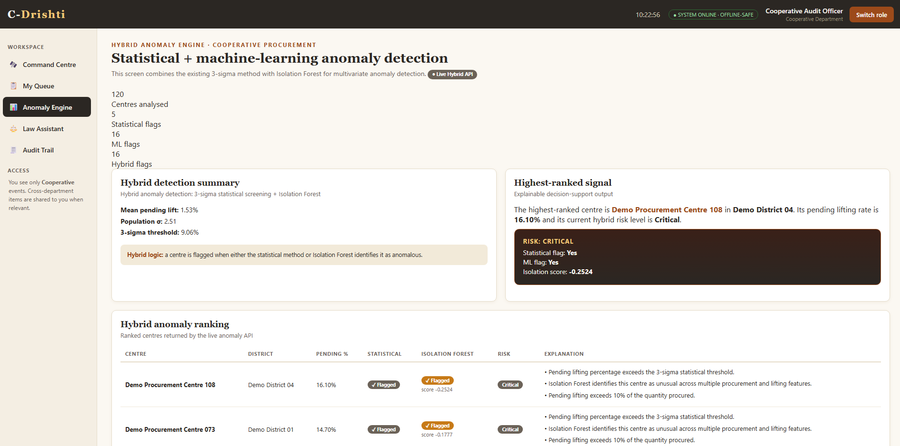
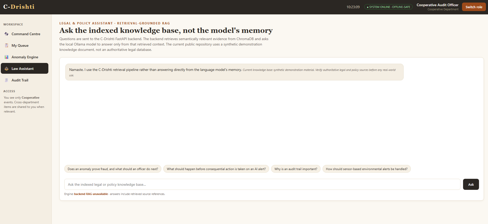
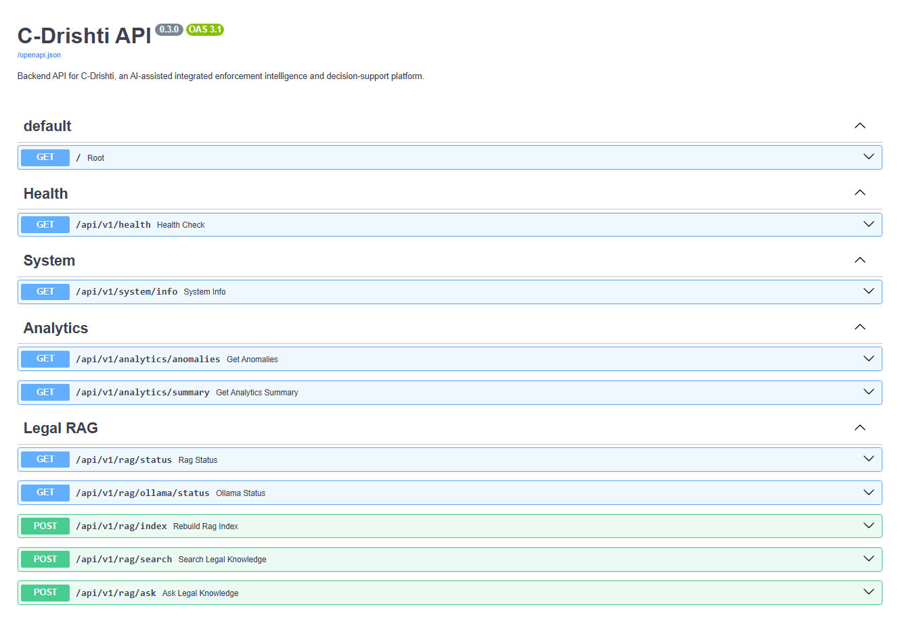

# C-Drishti

AI-assisted enforcement intelligence and decision-support platform combining **hybrid anomaly detection** with an **evidence-grounded Legal RAG assistant**.

[](https://github.com/Dr-AmitVishwakarma/C-Drishti/actions/workflows/tests.yml)

## Features

- Hybrid anomaly detection using **3-Sigma + Isolation Forest**
- Explainable anomaly ranking and risk classification
- Legal RAG using **Sentence Transformers + ChromaDB**
- Local LLM inference with **Ollama / Llama 3.2**
- Evidence filtering and source-aware responses
- Human-in-the-loop decision support
- FastAPI REST API
- Docker support
- Automated pytest suite

## Architecture

```text
                     C-Drishti
                         │
              ┌──────────┴──────────┐
              │                     │
       Anomaly Engine           Legal RAG
              │                     │
      ┌───────┴───────┐     Sentence Transformers
      │               │             │
   3-Sigma      Isolation Forest  ChromaDB
      │               │             │
      └───────┬───────┘        Legal Evidence
              │                     │
        Hybrid Risk             Ollama
        Classification          Llama 3.2
              │                     │
              └──────────┬──────────┘
                         │
                 FastAPI Backend
                         │
                         ▼
                Decision-Support UI


## Screenshots

### Integrated Dashboard

The main C-Drishti interface provides an integrated view of enforcement intelligence, analytics, and decision-support capabilities.



### Hybrid Anomaly Engine

The anomaly engine combines statistical 3-sigma detection with Isolation Forest to identify and prioritise unusual procurement patterns.



### AI-Assisted Legal Intelligence

The Legal Assistant uses retrieval-augmented generation to retrieve relevant legal evidence and generate evidence-grounded responses using a locally hosted LLM.



### FastAPI Backend

The backend exposes versioned REST APIs for system monitoring, anomaly analytics, legal retrieval, RAG generation, and health checks.



---


Backend: Python, FastAPI, Pydantic
ML: scikit-learn, Isolation Forest, Pandas, NumPy
RAG: Sentence Transformers, ChromaDB, PyPDF
LLM: Ollama, Llama 3.2
Engineering: Docker, Docker Compose, pytest, GitHub Actions

Run Locally
git clone https://github.com/Dr-AmitVishwakarma/C-Drishti.git
cd C-Drishti

python -m venv .venv

Windows:

.\.venv\Scripts\Activate.ps1
pip install -r backend\requirements.txt

Copy:

backend/.env.example → backend/.env

Start the backend:

cd backend
uvicorn app.main:app --reload --port 8000

Start the frontend from the project root:

python -m http.server 8080

Open:

http://localhost:8080

API documentation:

http://127.0.0.1:8000/docs
Local LLM

Install Ollama and pull the model:

ollama pull llama3.2:3b

Build the legal index using:

POST /api/v1/rag/index
Tests
pytest -v

The test suite covers the API, hybrid anomaly engine, validation, RAG filtering, safe refusal, and mocked LLM generation.

Docker
docker compose build
docker compose up -d
Responsible Use

C-Drishti is a research and engineering prototype.

Anomaly scores indicate unusual patterns, not fraud or wrongdoing. Legal RAG responses must be verified against authoritative sources before real-world use. Consequential decisions remain human-controlled.

License

MIT License. See LICENSE.